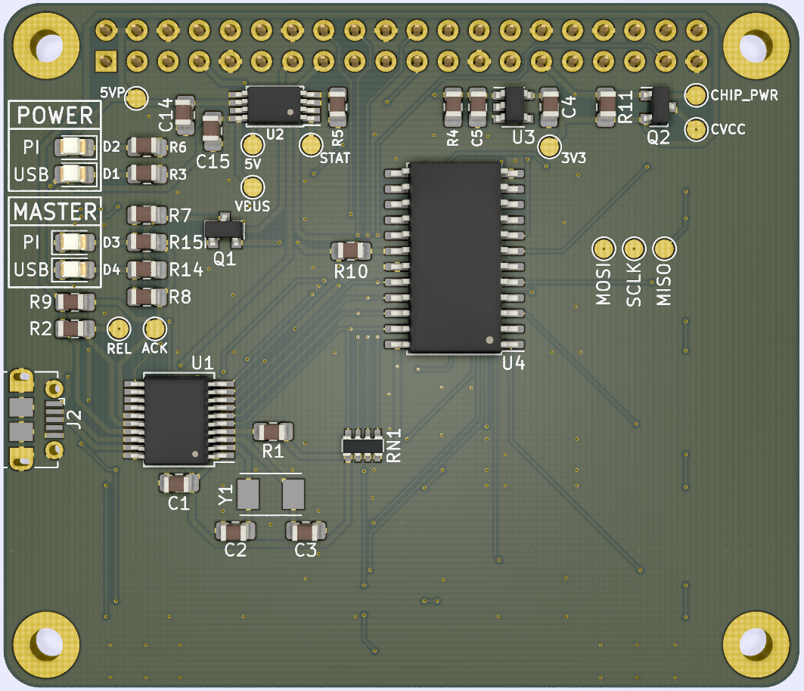
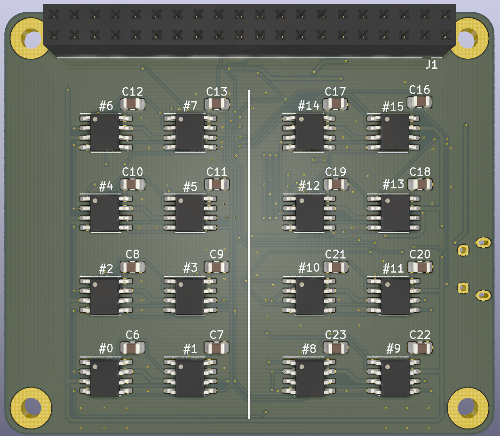

# Development / Testing Board

This directory contains design files and software for a development and testing
PCB that can hold up to 16 SPI memory chips using the 25-series pinout.

The PCB features a micro USB receptacle connected to a USB-to-SPI converter, and
can also be mounted on a Raspberry Pi, directly using the Pi's native SPI
peripheral (and Linux driver). The USB feature is useful for development of the
library on a regular PC, while the latter is useful for performing automated
Hardware-in-the-Loop testing.

